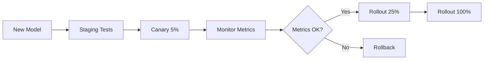

# Exercise 06: ML System Design and Workflow Planning

## Overview

**Estimated Time**: 3-4 hours
**Difficulty**: Intermediate to Advanced
**Prerequisites**:
- Completed Exercises 01-05
- Lecture 01: Machine Learning Overview for Infrastructure
- Basic understanding of ML concepts (training, inference, metrics)
- Familiarity with system design principles

## Learning Objectives

By completing this exercise, you will:
1. Design end-to-end ML workflows from requirements to deployment
2. Make informed trade-offs between training and inference strategies
3. Plan data pipelines with proper validation and preprocessing
4. Architect deployment strategies for different use cases
5. Estimate resource requirements (compute, storage, memory)
6. Apply ML infrastructure best practices to real-world scenarios

## Scenario

You are an ML infrastructure engineer at **TechShop**, an e-commerce company. The data science team has developed several ML models in Jupyter notebooks, but now needs your help to deploy them to production.

You'll work through **three different projects**, each with unique requirements and constraints. Your goal is to design the complete ML infrastructure for each project, documenting your decisions and trade-offs.

---

## Project 1: Product Recommendation System

### Business Requirements

**Goal**: Recommend products to users based on their browsing history and purchase behavior.

**Success Metrics**:
- Increase click-through rate (CTR) by 15%
- Increase average order value by 10%
- Serve recommendations with <100ms latency

**Scale**:
- 10 million active users/month
- 500,000 daily active users
- 100,000 products in catalog
- 1,000 recommendations requests/second at peak

**Data**:
- User browsing events (clicks, views, time on page)
- Purchase history
- Product catalog (title, category, price, description, image)
- User demographics (age, location, device)

---

### Task 1.1: Problem Definition and Model Selection

**Questions to answer**:

1. **What type of ML problem is this?**
   - [ ] Binary classification
   - [ ] Multi-class classification
   - [ ] Regression
   - [ ] Ranking/Recommendation
   - [ ] Clustering

2. **What model architecture would you choose?**

   Consider:
   - Collaborative filtering (user-item matrix factorization)
   - Content-based filtering (item features)
   - Hybrid approach
   - Deep learning (neural collaborative filtering)
   - Two-tower models

   **TODO**: Write your recommendation and justification (150-200 words).

   ```
   Your answer here:


   ```

3. **What are the key features you need?**

   Create a feature list with categories:

   ```python
   features = {
       "user_features": [
           # TODO: List 5-7 user features
           # Example: "user_age", "total_purchases_30d", ...
       ],
       "item_features": [
           # TODO: List 5-7 item features
       ],
       "interaction_features": [
           # TODO: List 3-5 interaction features
       ],
   }
   ```

### Task 1.2: Data Pipeline Design

Design the data pipeline from raw events to model-ready features.

**Architecture Diagram** (draw or describe):

```
[Raw Events]  →  [Ingestion]  →  [Processing]  →  [Feature Store]  →  [Training/Serving]
     ↓               ↓              ↓                  ↓                     ↓
   What?         How?            What?             Where?               How used?
```

**TODO**: Fill in each stage:

1. **Data Ingestion**
   ```yaml
   source: # Where does data come from?
   format: # JSON, Avro, Parquet?
   frequency: # Real-time, batch, micro-batch?
   volume: # How much data per day?
   tools: # Kafka, Kinesis, Cloud Pub/Sub?
   ```

2. **Data Preprocessing**
   ```python
   # TODO: List preprocessing steps
   preprocessing_steps = [
       "1. Remove duplicates",
       "2. Handle missing values",
       "3. ...",
   ]

   # TODO: Data validation checks
   validation_checks = [
       "1. Schema validation",
       "2. Data range checks",
       "3. ...",
   ]
   ```

3. **Feature Engineering**
   ```python
   # TODO: Describe feature transformations
   feature_transformations = {
       "user_age": "Bin into age groups (18-25, 26-35, ...)",
       "product_price": "...",
       "click_rate": "...",
   }
   ```

4. **Feature Store**
   ```yaml
   tool: # Feast, Tecton, custom?
   online_storage: # Redis, DynamoDB?
   offline_storage: # S3, BigQuery, Snowflake?
   freshness: # How often updated?
   ```

### Task 1.3: Training Infrastructure Design

**Training Strategy**:

1. **Compute Requirements**:
   ```yaml
   initial_training:
     data_size: # How much historical data?
     compute: # CPU/GPU, how many cores/GPUs?
     memory: # RAM needed?
     duration: # Estimated training time?

   retraining:
     frequency: # Daily, weekly, monthly?
     incremental: # Full retrain or incremental?
     trigger: # Schedule or performance-based?
   ```

2. **Training Pipeline**:
   ```python
   # TODO: Design training workflow (pseudocode or diagram)

   def training_pipeline():
       # Step 1: Load data
       # TODO: How much data? From where?

       # Step 2: Preprocess
       # TODO: Same preprocessing as serving?

       # Step 3: Split data
       # TODO: Train/val/test split strategy?

       # Step 4: Train model
       # TODO: Hyperparameters? How tuned?

       # Step 5: Evaluate
       # TODO: Metrics? Thresholds?

       # Step 6: Save model
       # TODO: Where? How versioned?

       return model
   ```

3. **Model Validation**:
   ```yaml
   offline_metrics:
     - # TODO: List metrics (AUC, NDCG, etc.)

   online_metrics:
     - # TODO: Business metrics (CTR, conversion)

   quality_thresholds:
     min_auc: # Example: 0.75
     max_latency_p99: # Example: 150ms
   ```

4. **Experiment Tracking**:
   ```yaml
   tool: # MLflow, Weights & Biases, custom?
   tracked_info:
     - model_architecture
     - hyperparameters
     - # TODO: What else?
   ```

### Task 1.4: Inference Strategy

Given the requirement of <100ms latency for 1,000 req/sec:

**Choice 1: Real-time vs Batch Inference**

| Approach | Pros | Cons | Latency | Suitable? |
|----------|------|------|---------|-----------|
| Real-time (compute on request) | Fresh predictions | High compute cost, latency challenge | 50-200ms | ? |
| Batch pre-compute (generate recommendations offline) | Low latency, lower cost | Stale recommendations | <10ms | ? |
| Hybrid (batch + real-time signals) | Balance freshness and cost | Complex architecture | 30-100ms | ? |

**TODO**: Choose approach and justify (100-150 words):

```
Your choice and justification:


```

**Infrastructure Design** (for chosen approach):

```yaml
serving_infrastructure:
  deployment_platform: # Kubernetes, ECS, Lambda?

  compute:
    instances: # How many?
    instance_type: # CPU, memory, GPU?
    autoscaling:
      min_replicas: # Minimum instances?
      max_replicas: # Maximum instances?
      metric: # CPU, requests/sec, custom?

  caching:
    tool: # Redis, Memcached?
    strategy: # What to cache?
    ttl: # Time-to-live?

  api:
    endpoint: # REST, gRPC?
    rate_limiting: # Requests per user?
    timeout: # Request timeout?
```

### Task 1.5: Deployment Plan

**Deployment Strategy**:



**TODO**: Design deployment checklist:

```yaml
pre_deployment:
  - [ ] Offline metrics meet thresholds
  - [ ] Load testing completed
  - [ ] # TODO: Add 3 more checks

deployment_steps:
  - [ ] Deploy to staging
  - [ ] Run integration tests
  - [ ] # TODO: Add 5 more steps

monitoring:
  - [ ] Latency (p50, p95, p99)
  - [ ] Error rate
  - [ ] # TODO: Add 5 more metrics

rollback_triggers:
  - [ ] Error rate > 1%
  - [ ] p99 latency > 150ms
  - [ ] # TODO: Add 3 more triggers
```

### Task 1.6: Cost Estimation

Estimate monthly infrastructure costs:

```yaml
training:
  compute: # Instance type, hours/month, cost
  storage: # Data storage, cost
  total: # $ per month

serving:
  compute: # Instances, cost
  cache: # Redis, cost
  api_gateway: # If applicable
  total: # $ per month

total_monthly_cost: # $ per month
cost_per_1000_requests: # $ per 1000 requests
```

---

## Project 2: Fraud Detection System

### Business Requirements

**Goal**: Detect fraudulent transactions in real-time to prevent financial loss.

**Success Metrics**:
- Catch 95%+ of fraudulent transactions (recall)
- Minimize false positives to <1% (precision matters!)
- Make decision within 300ms of transaction

**Scale**:
- 10,000 transactions/second
- 0.1% fraud rate (10 fraudulent per 10,000 transactions)
- $50 average transaction value
- $200 average fraud transaction value

**Data**:
- Transaction details (amount, merchant, location, time)
- User account history (age, total spend, avg transaction)
- Device fingerprint (IP, device ID, browser)
- Historical fraud labels

**Critical Constraint**: **False positives hurt user experience** (legitimate transactions declined)

---

### Task 2.1: Problem Analysis

1. **What makes this problem different from Project 1?**

   **TODO**: Write 150-200 words comparing:
   - Latency requirements
   - Class imbalance (0.1% fraud rate!)
   - Cost of errors (false positive vs false negative)
   - Real-time requirements

   ```
   Your analysis:


   ```

2. **Class Imbalance Strategy**:

   How will you handle 99.9% legitimate vs 0.1% fraud?

   **TODO**: Choose techniques (check all that apply):
   - [ ] Oversampling minority class (SMOTE)
   - [ ] Undersampling majority class
   - [ ] Class weights in loss function
   - [ ] Anomaly detection approach
   - [ ] Ensemble methods
   - [ ] Generate synthetic fraud examples

   **Justification** (100 words):
   ```


   ```

### Task 2.2: Real-Time Inference Architecture

Design a system that processes 10,000 transactions/second with <300ms latency:

```
Transaction → [API Gateway] → [Feature Service] → [Model] → [Decision] → [Response]
                                      ↓
                                [Feature Store]
                                 (Redis cache)
```

**TODO**: Fill in architecture details:

```yaml
api_gateway:
  tool: # AWS API Gateway, Kong, custom?
  rate_limiting: # Per user? Global?
  timeout: # Must be < 300ms

feature_service:
  async_calls: # Which features can be async?
  fallback: # What if feature service is down?
  caching_strategy: # What to cache?

model_serving:
  framework: # TensorFlow Serving, TorchServe, custom?
  optimization: # Quantization, ONNX?
  batching: # Dynamic batching?
  replicas: # How many model replicas?

fallback_strategy:
  primary_model_timeout: # What if model takes >300ms?
  model_unavailable: # What if model crashes?
  default_decision: # Approve or decline?
```

### Task 2.3: Feature Engineering for Real-Time

You need features computed in <50ms. Categorize features:

```python
features = {
    "precomputed_features": [
        # Computed offline, stored in cache
        # Example: "user_total_transactions_30d"
        # TODO: List 5-7 precomputed features
    ],

    "realtime_features": [
        # Computed on-the-fly from transaction
        # Example: "transaction_amount"
        # TODO: List 5-7 real-time features
    ],

    "aggregation_features": [
        # Need recent history, use streaming
        # Example: "transactions_last_5min"
        # TODO: List 3-5 aggregation features
    ],
}

# TODO: For each feature, estimate computation time
feature_latency = {
    "user_total_transactions_30d": "5ms (Redis lookup)",
    # TODO: Add more
}
```

### Task 2.4: Monitoring and Alerting

Fraud detection requires extensive monitoring:

**TODO**: Design monitoring dashboard:

```yaml
model_performance:
  metrics:
    - precision
    - recall
    - f1_score
    - # TODO: Add 3 more

  alerts:
    - name: "Recall dropped"
      condition: "recall < 0.93"
      severity: critical
    # TODO: Add 4 more alerts

system_performance:
  metrics:
    - p50_latency
    - p99_latency
    - error_rate
    - # TODO: Add 3 more

  alerts:
    - # TODO: Define 3 alerts

business_metrics:
  metrics:
    - fraud_caught_value
    - false_positive_cost
    - # TODO: Add 3 more
```

### Task 2.5: A/B Testing Strategy

How do you safely deploy a new fraud model?

**TODO**: Design A/B test:

```yaml
experiment_design:
  control_group: # What % of traffic?
  treatment_group: # What % of traffic?
  duration: # How long to run?

success_criteria:
  primary_metric: # What determines success?
  guardrail_metrics: # What must not get worse?

decision_framework:
  # When do you promote treatment to 100%?
  # When do you rollback?
```

---

## Project 3: Image Classification for Product Moderation

### Business Requirements

**Goal**: Automatically detect inappropriate product images uploaded by sellers.

**Success Metrics**:
- Detect 98%+ inappropriate images
- Process images within 5 seconds of upload
- Handle 1,000 image uploads/hour

**Scale**:
- Average image size: 2MB
- Image resolution: 800x600 to 4000x3000
- 10,000 new products/day
- Storage: 50TB of images

**Data**:
- Product images
- Labels: appropriate/inappropriate (categories: violence, nudity, hate symbols, etc.)
- Image metadata (uploader, timestamp, product category)

---

### Task 3.1: Data Pipeline for Images

**TODO**: Design image processing pipeline:

```yaml
upload_flow:
  1_image_upload:
    storage: # S3, GCS, where?
    validation: # File type, size limits?

  2_preprocessing:
    resize: # Target resolution?
    format_conversion: # JPEG, PNG?
    normalization: # Pixel value scaling?

  3_inference:
    when: # Synchronous or async?
    batching: # Process multiple images together?

  4_result_storage:
    where: # Database, cache?
    retention: # How long to keep?
```

### Task 3.2: Model Optimization

Given 5-second latency requirement and 2MB images:

**TODO**: Optimize inference:

```yaml
model_optimization:
  architecture:
    choice: # ResNet, EfficientNet, MobileNet?
    justification: # Why this architecture?

  optimization_techniques:
    - [ ] Quantization (INT8, FP16)
    - [ ] Model pruning
    - [ ] Knowledge distillation
    - [ ] ONNX conversion
    - [ ] TensorRT compilation
    - [ ] Batch processing

  hardware:
    cpu_inference: # Can we use CPU?
    gpu_inference: # Need GPU? Which type?
    edge_deployment: # Process on device?

expected_performance:
  latency_per_image: # Milliseconds?
  throughput: # Images/second?
  cost_per_1000_images: # $?
```

### Task 3.3: Batch vs Streaming Architecture

**TODO**: Choose processing mode:

| Mode | When to Use | Architecture |
|------|-------------|--------------|
| **Synchronous** | User waits for result | API → Model → Response |
| **Asynchronous Batch** | Process overnight | Queue → Batch Job → Results DB |
| **Streaming** | Near real-time | Kafka → Consumer → Model → Results |

**Your choice**: _______________

**Architecture diagram**:
```
[Draw or describe your chosen architecture]


```

### Task 3.4: Handling False Positives

What happens when model incorrectly flags appropriate image as inappropriate?

**TODO**: Design human-in-the-loop system:

```yaml
confidence_thresholds:
  auto_approve: # Confidence > X%
  auto_reject: # Confidence < Y%
  human_review: # Between X% and Y%

review_queue:
  prioritization: # What gets reviewed first?
  sla: # How quickly reviewed?
  feedback_loop: # How to retrain from reviews?

appeals_process:
  seller_can_appeal: # yes/no
  review_process: # Who reviews appeals?
```

---

## Deliverables

### Document 1: Architecture Decision Records (ADR)

For each project, create an ADR:

```markdown
# ADR: [Project Name] ML System Design

## Context
[Describe business requirements and constraints]

## Decision
[Your chosen architecture and approach]

## Rationale
[Why this approach? What alternatives considered?]

## Consequences
### Positive
- [Benefit 1]
- [Benefit 2]

### Negative
- [Trade-off 1]
- [Trade-off 2]

### Risks
- [Risk 1 and mitigation]
```

### Document 2: Resource Estimation Spreadsheet

Create a table estimating costs:

| Component | Resource Type | Quantity | Unit Cost | Monthly Cost |
|-----------|---------------|----------|-----------|--------------|
| Training compute | GPU hours | X | $Y | $Z |
| Serving compute | EC2 instances | X | $Y | $Z |
| Storage | S3 | X GB | $Y | $Z |
| Database | RDS | X | $Y | $Z |
| Caching | Redis | X GB | $Y | $Z |
| **TOTAL** | | | | **$Z** |

### Document 3: Deployment Runbook

Create step-by-step deployment instructions:

```markdown
# Deployment Runbook: [Project Name]

## Pre-Deployment
- [ ] Checklist item 1
- [ ] Checklist item 2

## Deployment Steps
1. Step 1
2. Step 2
...

## Monitoring
- Metric 1: Threshold X
- Metric 2: Threshold Y

## Rollback Procedure
1. Step 1
2. Step 2
```

---

## Success Criteria

- [ ] All three projects have complete architecture designs
- [ ] Trade-offs are documented and justified
- [ ] Resource estimates are realistic
- [ ] Latency requirements can be met
- [ ] Cost estimates are within reasonable range
- [ ] Monitoring and alerting plans are comprehensive
- [ ] Rollback and incident response procedures are clear

---

## Troubleshooting

### How detailed should my designs be?

Focus on **key decisions and trade-offs**, not implementation details. For example:
- ✅ "Use Redis for sub-10ms feature lookup"
- ❌ "Redis configuration: maxmemory=2gb, eviction-policy=lru..."

### How do I estimate costs without cloud experience?

Use rough estimates:
- GPU training: $1-3/hour
- CPU serving instance: $50-200/month
- Storage: $0.02-0.05/GB/month
- Database: $100-500/month

### What if I'm unsure about architecture choices?

That's expected! Document your uncertainty and reasoning:
- "Chosen X over Y because of Z, but concerned about A"
- Compare options in a table

---

## Bonus Challenges

### Challenge 1: Multi-Model System

Design a system that uses **multiple models in a pipeline**:
- Image classification → Object detection → OCR text extraction

How do you orchestrate this?

### Challenge 2: Model Serving at Edge

What if Project 3 (image moderation) needs to run **on mobile devices**?

How would you:
- Compress model to <50MB
- Optimize for mobile CPUs
- Handle offline scenarios

### Challenge 3: Cost Optimization

You're told to **cut infrastructure costs by 50%** for Project 1.

What would you sacrifice? What would you optimize?

### Challenge 4: Multi-Region Deployment

Design **global deployment** for Project 2 (fraud detection):
- Users in US, EU, Asia
- <300ms latency requirement
- Data residency regulations (GDPR)

---

## References

- **Lecture 01**: Machine Learning Overview for Infrastructure
- **Exercise 01-05**: PyTorch, TensorFlow, ONNX, LLM, GPU basics
- **Google SRE Book**: Monitoring and alerting best practices
- **AWS Well-Architected Framework**: ML Lens
- **Chip Huyen's "Designing Machine Learning Systems"** (Book)
- **Eugene Yan's Blog**: https://eugeneyan.com/ (Real-world ML systems)

---

## Reflection Questions

1. How do training requirements differ from serving requirements?
2. When would you choose batch inference over real-time?
3. How does class imbalance affect model deployment?
4. What are the trade-offs between model accuracy and latency?
5. How do you validate that a new model is safe to deploy?
6. What monitoring metrics are most critical for ML systems?
7. How do you estimate infrastructure costs before building a system?

---

**Estimated Completion Time**: 3-4 hours

**Next Exercise**: Continue to inference optimization or model serving exercises.
